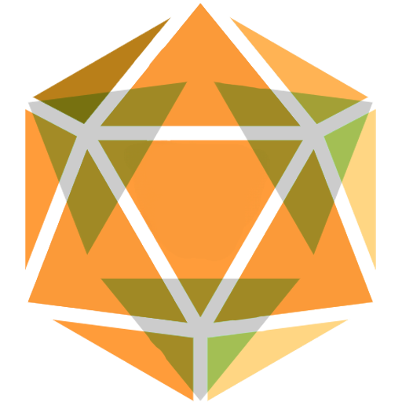

<h1>three20</h1>

Tabletop dice-rolling simulation

Made with:
[Vite](https://vitejs.dev/)
[React-three-fiber](https://docs.pmnd.rs/react-three-fiber/getting-started/introduction)
[use-cannon](https://github.com/pmndrs/use-cannon)
[cannon.js](https://schteppe.github.io/cannon.js/)

Try live: [three20](https://dice.br-ndt.dev/)

Or run locally: `npm i && npm run dev `

If you are interested in contributing, send a message to either [Tyler](https://github.com/br-ndt) or [Varun](https://github.com/vanadgir)

